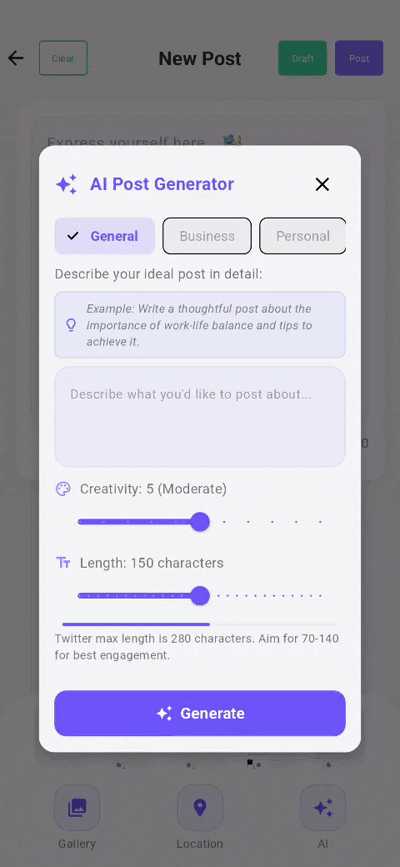

# Vouse - Social Media Management Platform 🚀

   
   
  <strong>Manage your social presence with AI-powered simplicity.</strong>
   
   
  <!-- Add relevant badges here: Build Status, License, etc. -->
  <!-- Example:  -->
  
  
  
  

## ✨ About Vouse

Vouse is an integrated social media management platform designed to streamline content creation, scheduling, and analysis across multiple social networks (starting with Twitter/X). It combines an intuitive mobile experience built with **Flutter** and a powerful, scalable backend powered by **NestJS**. Simplify your social media workflow and gain insights into your performance with Vouse!

<!-- Optional: Add a compelling GIF/Screenshot here -->

## 🚀 Key Features

*   📱 **Cross-Platform Mobile App:** Manage your accounts anywhere using the Flutter app (iOS & Android).
*   🔗 **Twitter/X Integration:** Securely connect and manage your Twitter presence.
*   🔒 **Secure Authentication:** Client-side authentication using Firebase SDKs, with backend token verification.
*   🤖 **AI-Assisted Content:** Leverage Firebase Vertex AI SDK directly in the client app for smarter content suggestions.
*   ⏰ **Advanced Scheduling:** Plan and automate your posts with a reliable queue system.
*   📊 **Performance Analytics:** Track key engagement metrics for your published content.
*   🔔 **Real-time Notifications:** Stay informed with push notifications.
*   🗺️ **Location Tagging:** Add geographical context to your posts.

## 🛠️ Core Technologies

<!-- Add others if desired -->

## 📂 Repository Structure

This repository contains the two main components of the Vouse platform:

*   **`vouse_flutter/`**: The cross-platform mobile client built with Flutter.
    *   ➡️ [**Go to Flutter Client README**](vouse_flutter/README.md)
*   **`vouse_server/`**: The backend API server built with NestJS.
    *   ➡️ [**Go to Server README**](vouse_server/README.md)

## 🏛️ Architecture

Vouse employs a client-server architecture:
*   The **Flutter client** provides the user interface, leveraging **Riverpod** for state management and following **Clean Architecture** principles (Domain, Data, Presentation layers). It interacts with the backend API via a **Retrofit/Dio** client and handles local data persistence and secure storage.
*   The **NestJS server** handles core business logic, data persistence (PostgreSQL via **TypeORM**), background jobs (Redis via **BullMQ**), and communication with external services (Firebase, Twitter API). It uses a **modular design** based on NestJS conventions.

*(See individual READMEs for more detailed architecture information)*

## ⚙️ Getting Started

To get started with development, please refer to the specific setup instructions within each component's directory:

*   ➡️ [**Flutter Client Setup Guide**](vouse_flutter/README.md#⚙️-getting-started)
*   ➡️ [**Backend Server Setup Guide**](vouse_server/README.md#⚙️-getting-started)

## 🙏 Contributing

Contributions are welcome! Please follow standard fork-and-pull-request workflow.

1.  Fork the repository.
2.  Create your feature branch (`git checkout -b feature/amazing-feature`).
3.  Commit your changes (`git commit -m 'Add some amazing feature'`).
4.  Push to the branch (`git push origin feature/amazing-feature`).
5.  Open a Pull Request.

## 📄 License

All rights reserved. This project and its contents are proprietary.

## 📞 Contact

For inquiries, please open an issue on this GitHub repository.
